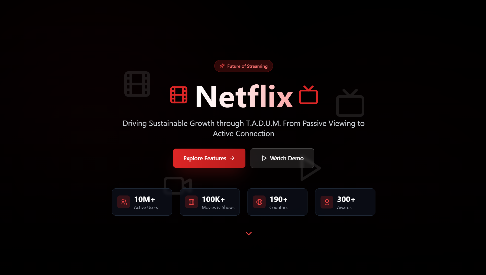

    

        
    

    

            <h3><b>Netflix</b></h3>
            
<i>Driving Sustainable Growth through T.A.D.U.M. From Passive Viewing to Active Connection</i>

    

 
<h1 align="center">TA-DÚM - SSO 2.0 Team - DIG IN HIMSISFO 2025</h1>

 

---

## 🎯 Project Overview

**Netflix TADUM** is a conceptual prototype that reimagines the future of Netflix as a **social, intelligent, and sustainable entertainment platform**.

TADUM is not just a UI redesign, but a **modular innovation framework** that enhances:

* Content discovery
* User engagement
* Community interaction
* AI-driven operations
* Sustainability & energy efficiency

This repository contains **high-fidelity UI/UX prototypes** for six core features designed to demonstrate how Netflix can evolve into a **living entertainment ecosystem**, not just a passive streaming service.

---

## 🧠 What is TADUM?

**TADUM** represents **5 innovation pillars**:

| Letter | Meaning                          | Focus                            |
| ------ | -------------------------------- | -------------------------------- |
| **T**  | Transformative Social Experience | Netflix FYP & Netflix Bot        |
| **A**  | Amplifying Connection            | Netflix Forum & Netflix Friends
| **D**  | Dynamic AI Operations            | AI-powered QC & Operations       |
| **U**  | Unified Data Flywheel            | Adaptive & Living Data System    |
| **M**  | Maximize Sustainability          | Cost, Energy & Carbon Efficiency |

---

## ✨ Features Overview

### 📺 Netflix FYP (For You Page)

A short-video, vertical scrolling discovery experience inspired by social platforms.

**Highlights:**

* Auto-playing cinematic clips (5–20s)
* Scrollable vertical feed
* Mood & genre tags
* Instant “Watch Now” jump
* Designed for discovery & acquisition

🎬 *From browsing fatigue to instant excitement.*

---

### 🤖 Netflix Bot

An interactive movie companion that lives inside Netflix.

**Capabilities:**

* Explain scenes & jokes in real-time
* Recommend content based on taste
* Context-aware responses while watching
* Clean chat-based UI

💬 *Your personal movie guide.*

---

### 💬 Netflix Forum

A safe, curated discussion space inside Netflix.

**Features:**

* Movie & series discussion threads
* Spoiler-safe UI
* Trending topics by region
* Verified Reviewer badges

👥 *From passive viewers to active community.*

---

### 👥 Netflix Friends

A social graph layer for Netflix.

**Includes:**

* Follow friends
* See what friends are watching
* Social-proof recommendations
* Privacy-aware sharing

🤝 *Entertainment is better together.*

---

### 🌱 Netflix Saving Mode

A sustainability-focused viewing feature.

**Key ideas:**

* Auto-sleep when user inactive
* Smart brightness & resolution tuning
* Energy usage awareness
* Environmentally friendly streaming

♻️ *Watch smarter, waste less.*

---

### 📊 Netflix Dashboard

A personal insight & analytics dashboard for users.

**Shows:**

* Watching hours
* Energy saved (Saving Mode)
* Favorite genres & moods
* Community activity stats

📈 *Turn viewing habits into insights.*

---

## 📸 UI Preview

<table style="width:100%; text-align:center">
<tr>
<td></td>
<td></td>
</tr>
<tr>
<td>Netflix FYP</td>
<td>Netflix Bot</td>
</tr>
<tr>
<td></td>
<td></td>
</tr>
<tr>
<td>Netflix Forum</td>
<td>Netflix Friends</td>
</tr>
<tr>
<td></td>
<td></td>
</tr>
<tr>
<td>Netflix Saving Mode</td>
<td>Netflix Dashboard</td>
</tr>
</table>

---

## 🚀 Purpose of This Repository

* UI/UX Prototype
* Innovation Proposal Visualization
* Part of Our Competition Submission
* Product Concept Exploration

⚠️ *This project is not affiliated with Netflix.*

---

## 👥 Owner

This Repository is created by Team SSO 2.0 - DIG IN HIMSISFO 2025
<ul>
<li>Stanley Nathanael Wijaya - Team Leader</li>
<li>Britney Angeline Soeseno</li>
<li>Nadya Angelie Lislie</li>
</ul>
As Netflix Prototype for The Future Based on our Solution

---

## 📬 Contact
Have questions or want to collaborate?

- 📧 Email: stanley.n.wijaya7@gmail.com
- 💬 Discord: `stynw7`

<code>Made with ❤️ by Team SSO 2.0</code>